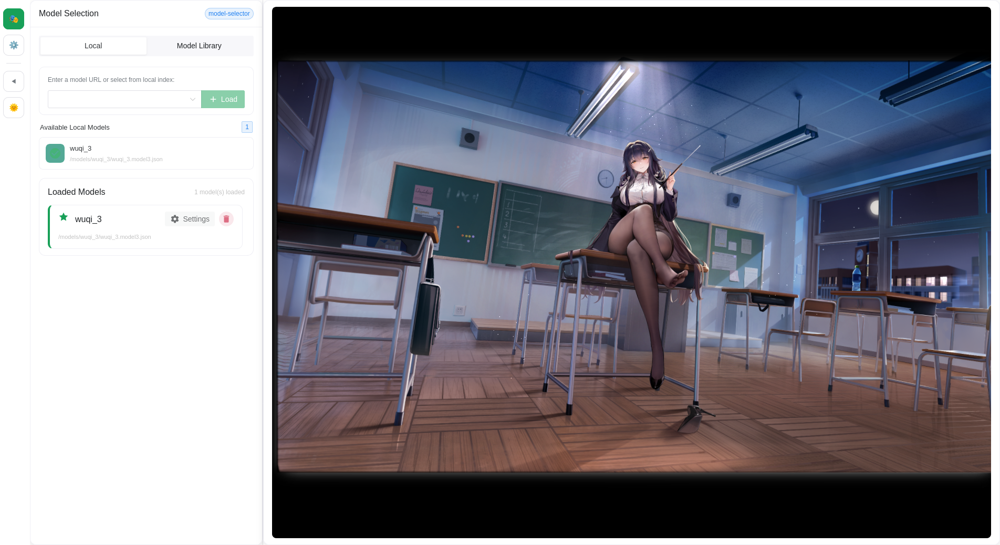

# Live2D Viewer

A lightweight Live2D model viewer built with Vue 3 + PIXI.js + Cubism SDK. Easily browse and interact with Live2D models.

> This project was generated with AI assistance and has not been thoroughly tested. If you encounter bugs, feel free to ask an AI model for help.



## ✨ Features

- 🎭 **Live2D Model Rendering** — Powered by PIXI.js and Cubism SDK, supports Cubism 3/4 models
- 📚 **Online Model Library** — Built-in model library browser, searchable by game/character/costume
- 📂 **Local Model Loading** — Load models from a local directory or custom URL
- 🎮 **Rich Interactions** — Click interactions, expression control, motion playback, eye tracking
- ⚙️ **Model Parameter Tuning** — Scale, position, rotation, breathing animation, blinking, and more
- 🌗 **Theme Switching** — Light / Dark / Auto themes
- 🎨 **Modern UI** — Vue 3 + Pinia + Naive UI with a draggable split-panel layout

## 🚀 Getting Started

### Prerequisites

- **Node.js** 18+ (LTS recommended)
- **npm** 8+

### Installation

```bash
# 1. Clone the repository
git clone https://github.com/saro0019473/Live2d-Viewer.git
cd Live2d-Viewer

# 2. Install dependencies
npm install

# 3. Generate local model index (if you have model files in public/models/)
npm run generate-models-index

# 4. Start the development server
npm run dev
```

Open `http://localhost:5173` in your browser.

### Production Build

```bash
npm run build
npm run preview   # Preview the build output
```

## 📖 Usage

### Loading Models

The left panel provides three ways to load models:

| Method | Description |
|--------|-------------|
| **Model Library** | Browse and load from the built-in online model library, organized by Game → Character → Costume |
| **Local Models** | Select from local models in the `public/models/` directory |
| **Custom URL** | Manually enter a `.model.json` or `.model3.json` URL to load |

### Menu

| Icon | Menu | Description |
|------|------|-------------|
| 🎭 | **Model Selection** | Browse and load Live2D models |
| ⚙️ | **Model Setup** | Adjust display parameters and interaction settings for loaded models |

### Adding Local Models

```bash
# 1. Place your model folder into the public/models/ directory
# 2. Regenerate the model index
npm run generate-models-index

# 3. Restart the dev server — the model will appear in the Local tab
```

## 🗂️ Project Structure

```
src/
├── components/
│   ├── Live2DViewer.vue        # Main Live2D rendering component
│   ├── ModelSelector.vue       # Model selector (local + online library)
│   ├── ModelSettings.vue       # Model parameter settings
│   └── ErrorBoundary.vue       # Error boundary component
│   └── settings/
│       ├── SettingSlider.vue    # Slider setting component
│       └── SettingSwitch.vue   # Toggle switch setting component
├── stores/
│   ├── live2d.ts               # Live2D model state management
│   └── theme.ts                # Theme state
├── utils/
│   ├── resource-manager.ts     # Global resource manager
│   └── live2d/
│       ├── index.ts            # Live2D utilities entry
│       ├── live2d-manager.ts   # Live2D manager
│       ├── core-manager.ts     # Core manager
│       ├── model-manager.ts    # Model manager
│       ├── animation-manager.ts# Animation manager
│       ├── interaction-manager.ts # Interaction manager
│       ├── hero-model.ts       # Model wrapper
│       ├── state-sync-manager.ts # State sync manager
│       └── utils.ts            # Utility functions
├── config/
│   └── debug.ts                # Debug configuration
├── styles/
│   └── app-styles.css          # Global styles
├── App.vue                     # Root component
├── main.ts                     # Application entry point
└── style.css                   # Base styles
```

## 🔧 Tech Stack

| Category | Technology |
|----------|------------|
| Framework | Vue 3.5 (Composition API) |
| Build Tool | Vite 6 |
| UI Library | Naive UI 2.44 |
| State Management | Pinia 2.3 |
| 2D Rendering | PIXI.js 7 (dynamically loaded) |
| Live2D | Cubism SDK (Cubism 3/4) |

## 🔗 Model Resources

- [Live2d-model](https://github.com/Eikanya/Live2d-model) — A large collection of Live2D model assets

## 📄 License

MIT License

## 🙏 Acknowledgements

- [Vue.js](https://vuejs.org/) — The Progressive JavaScript Framework
- [PIXI.js](https://pixijs.com/) — 2D Rendering Engine
- [Live2D](https://www.live2d.com/) — Live2D Technology
- [Naive UI](https://www.naiveui.com/) — Vue 3 Component Library
